# PetMart Project

*(Note: this is a backup of the original project which is on Bitbucket)*

## Project Desctiption
PetMart is an online pet trading app designed for the iOS platform. It aims to provide convenient services to both the buyers and the sellers. The buyers can view, search/filter and buy pets and their accessories through this app. They can also view the seller's information and message, comment on/rate them (after sign up/sign in). The sellers can post the pets/accessories they want to sell and edit them whenever they want. Both parties can update their personal information to reflect their current status. The user can safely sign out or log in to their account in another phone and all the information will be kept.

## Language and Tools
**Language**: Dart

**Frontend**: Flutter

**Backend**: Firebase

## App demonstration walkthrough
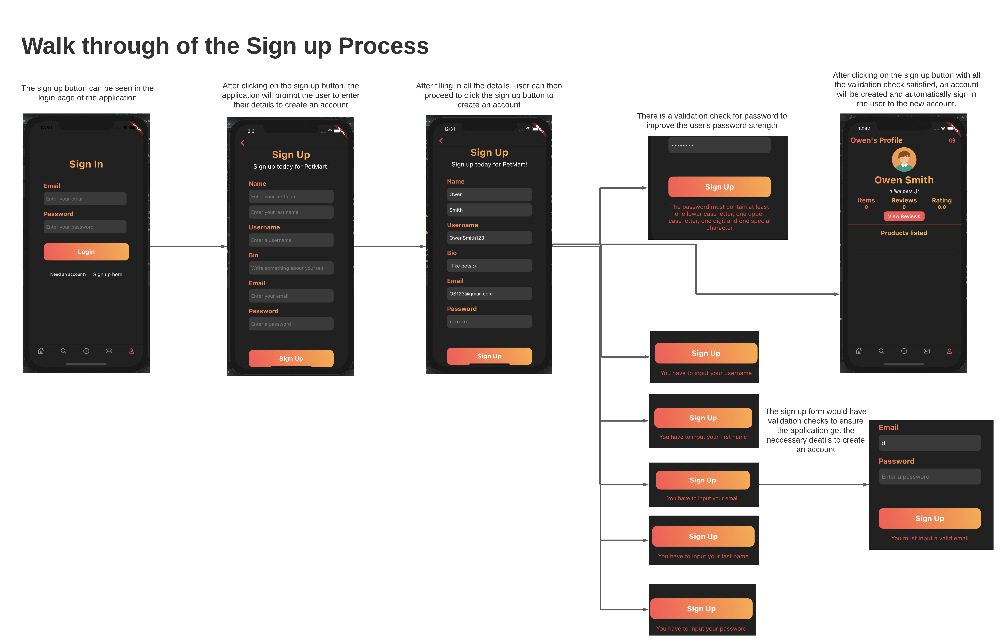
---
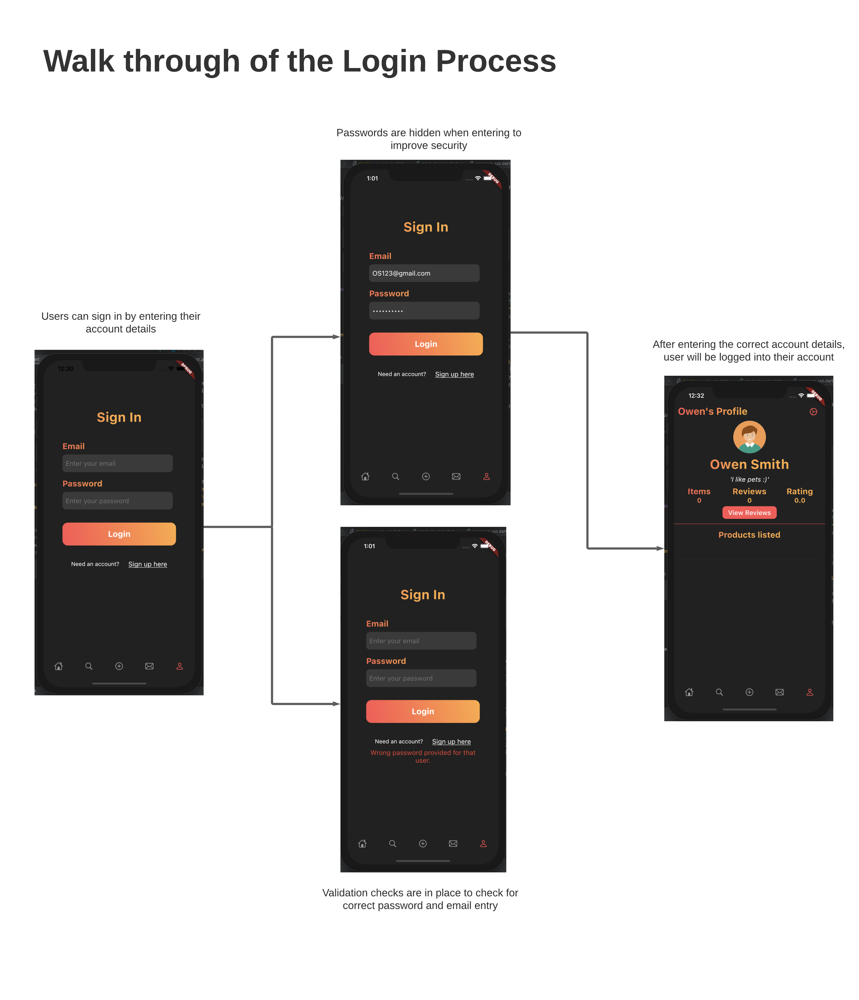
---
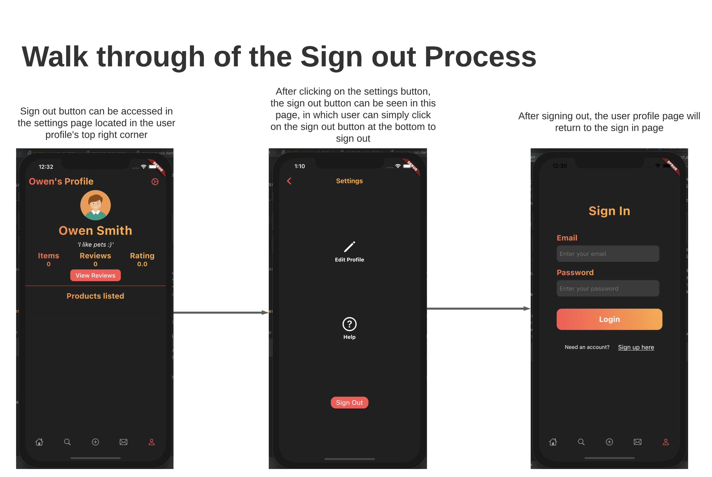 
---
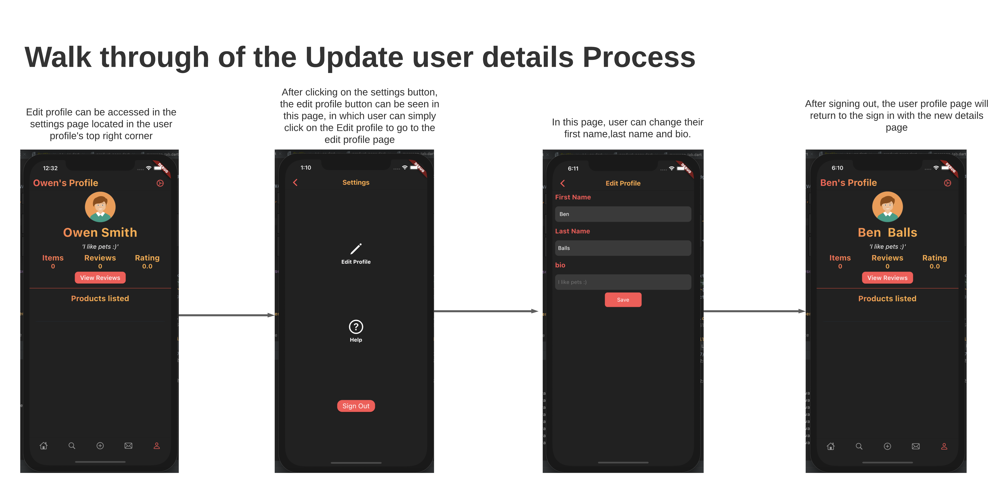
---
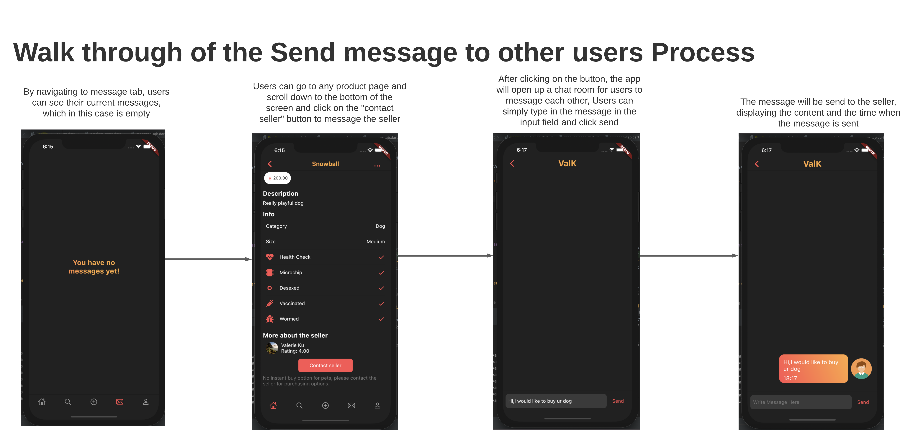 
---
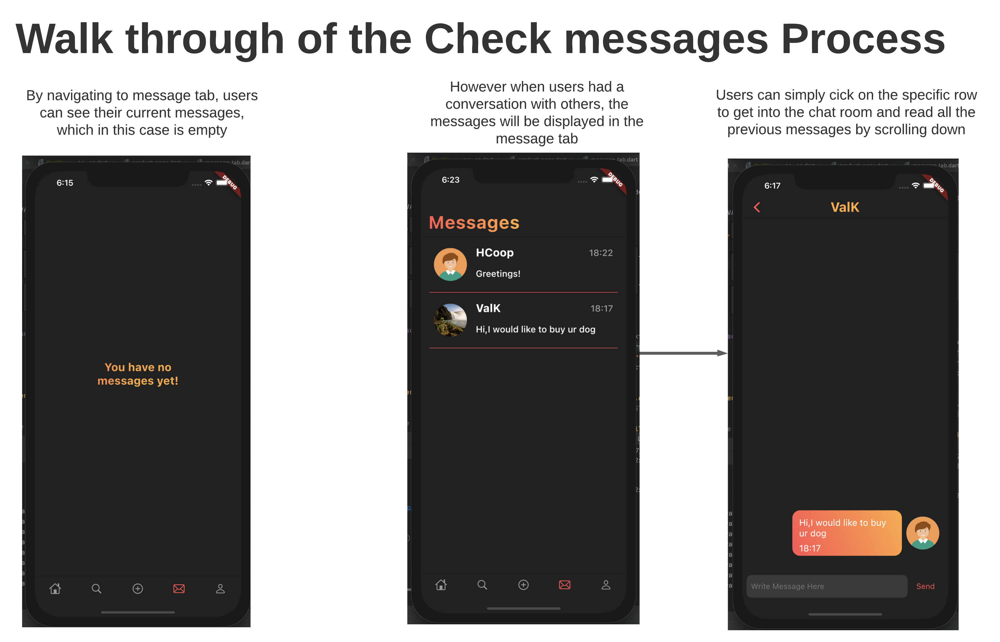
---
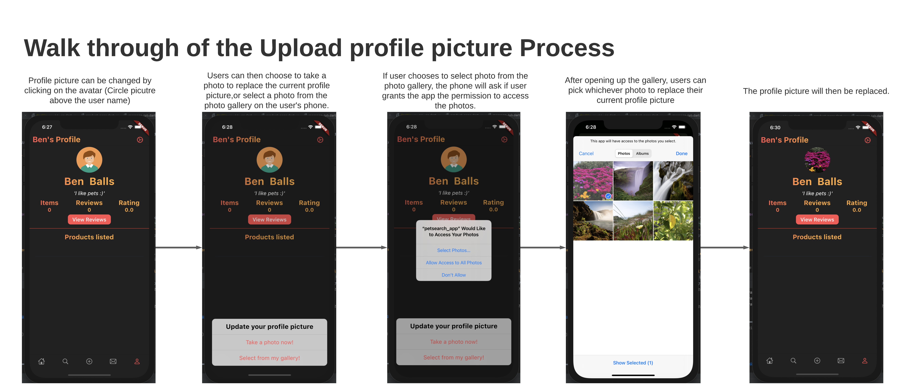 
---
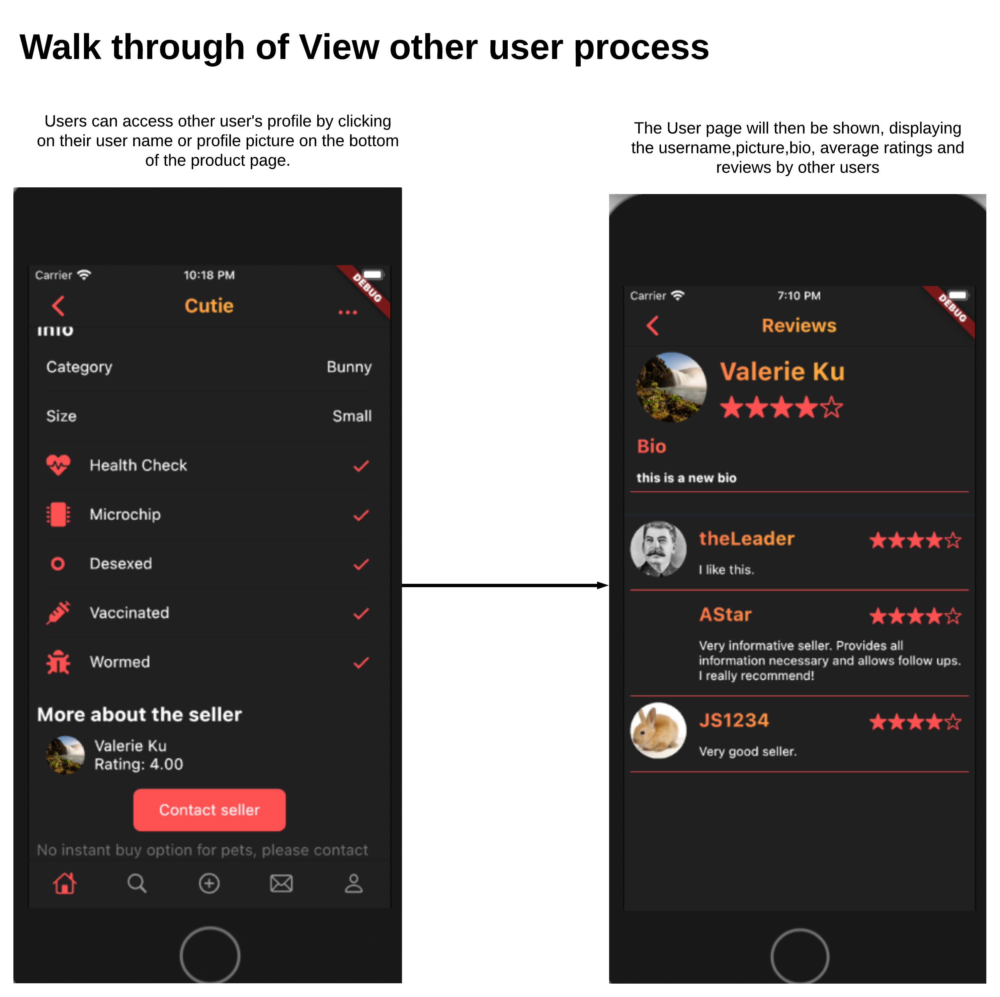
---
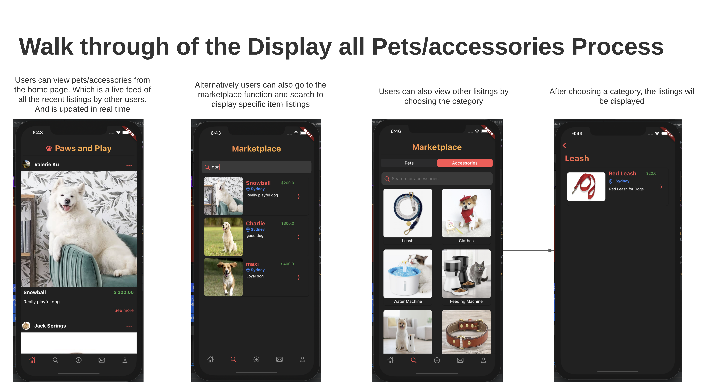  
---
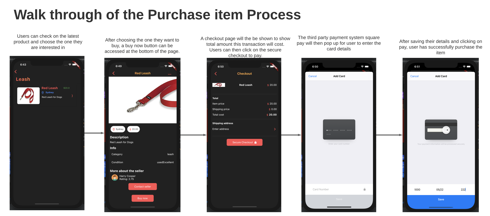
---
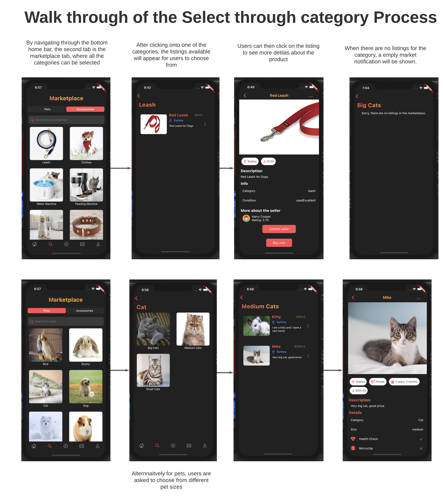 
---
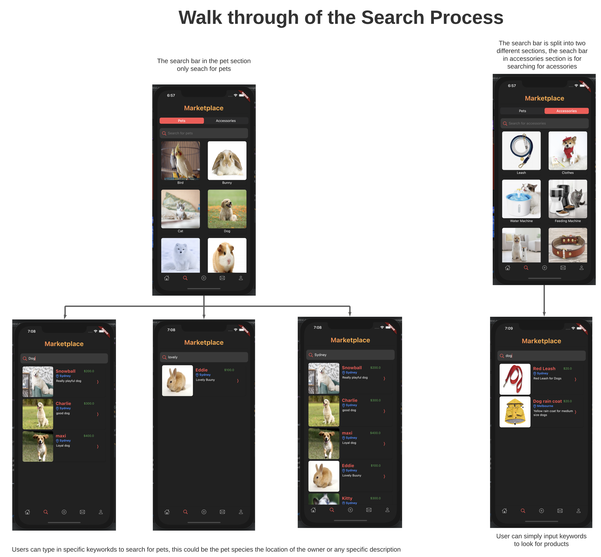
---
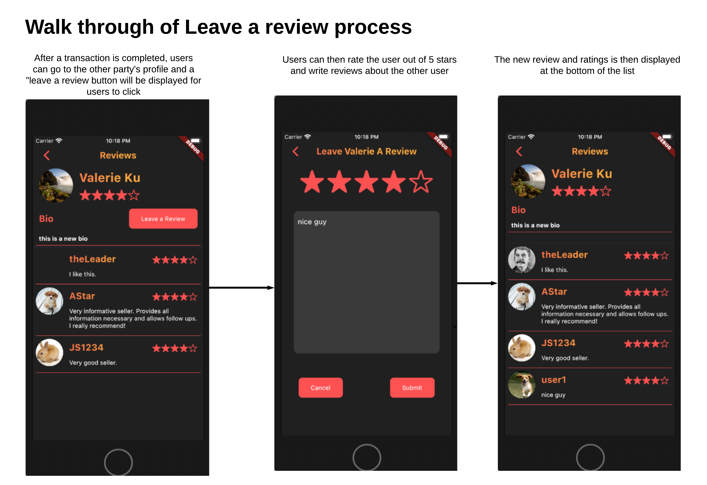  
---
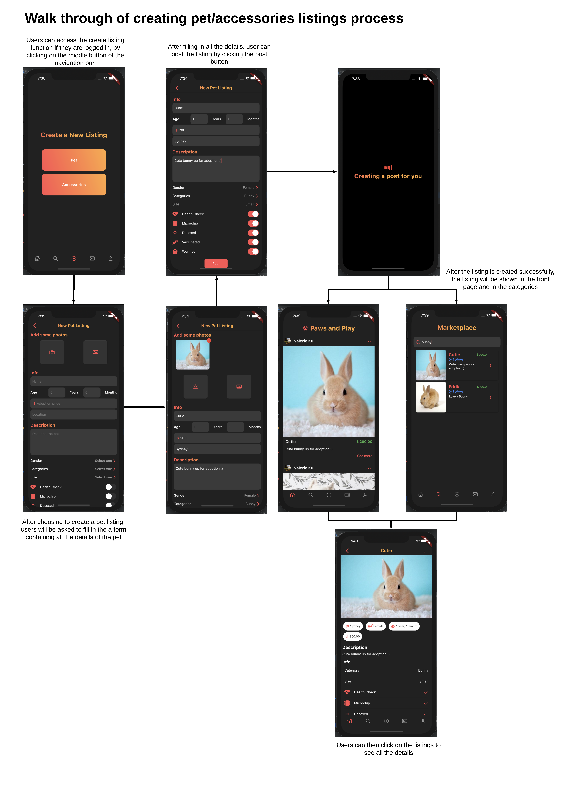
